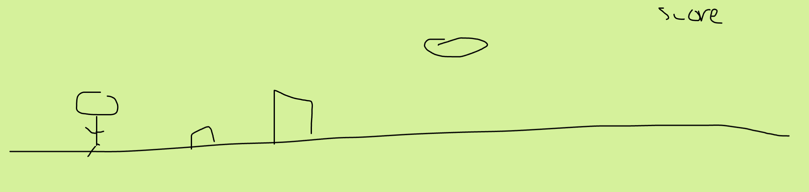

:warning: Everything between << >> needs to be replaced (remove << >> after replacing)

# Mars Patrol
## CS110 Final Project  Fall, 2023

## Team Members

Steven Lin

Andrew Zou

***

## Project Description

A version  of Moon Patrol. 

***    

## GUI Design

### Initial Design

### Final Design

## Program Design

### Features

1. start menu
2. moveable character
3. obstacle collisions
4. scrolling background
5. game over screen

### Classes

- << You should have a list of each of your classes with a description >>

## ATP

